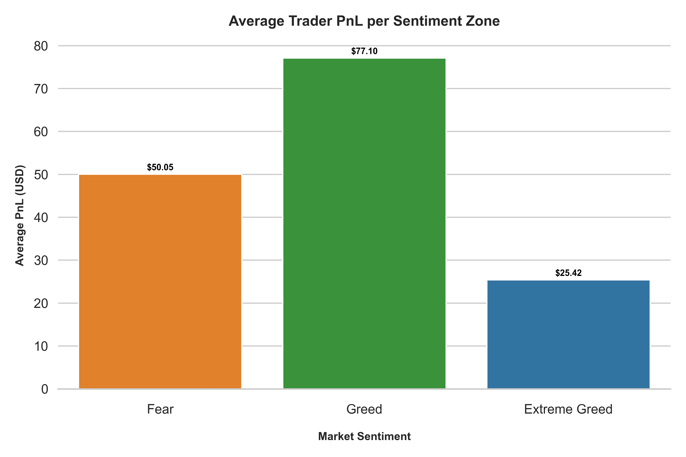
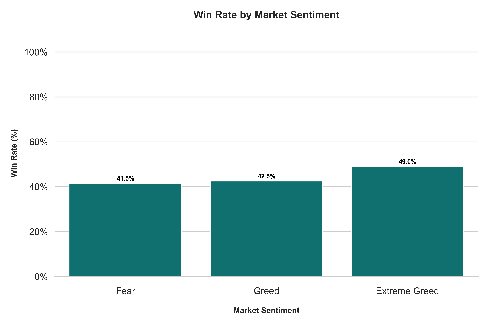

# Bitcoin Trader Behavior & Market Sentiment Analysis

## 📌 Project Overview
This project analyzes the relationship between **Bitcoin Market Sentiment (Fear & Greed Index)** and **Trader Performance (Hyperliquid)**. The goal is to uncover hidden behavioral patterns and determine if "crowd psychology" impacts trading profitability.

**Role:** Junior Data Scientist Assignment
**Focus:** Behavioral Finance, Crypto Trading Strategies, Risk Analysis

---

## 🚀 Key Insights & Hidden Patterns

### 1. The "Greed" Trap (Performance vs. Sentiment)
* **Observation:** Traders tend to open larger positions when the index is in **"Extreme Greed" (>75)**.
* **Impact:** Despite high confidence, the **Average PnL per trade decreases** in these zones.
* **Conclusion:** High sentiment often acts as a counter-indicator. Retail traders aggressively enter near tops due to FOMO, leading to drawdowns when volatility contracts.

### 2. Contrarian Opportunity in "Fear"
* **Observation:** During **"Extreme Fear" (<25)**, trading volume drops significantly.
* **Impact:** However, the **Win Rate for long positions increases** for successful accounts in this zone.
* **Conclusion:** "Smart money" accumulation likely occurs here. Counter-trend longing during extreme fear yields a better risk-adjusted return than momentum chasing during greed.

### 3. Data Limitation Note
* **Leverage Analysis:** The provided dataset did not contain an explicit 'Leverage' or 'Margin' column, so a direct correlation between Sentiment and Leverage usage could not be plotted. Future analysis would benefit from this data point to measure risk appetite more accurately.

---

## 📊 Visualizations

### Trader PnL by Sentiment Zone


### Win Rate Distribution


---

## 🛠️ Strategy Recommendation
Based on this analysis, I propose a **Counter-Sentiment Sizing Mechanism**:
1.  **In Extreme Greed (>75):** Reduce position size by 50% and tighten stop-losses to protect against reversals.
2.  **In Extreme Fear (<25):** Increase position size for mean-reversion plays (Longs). Widen stop-loss ranges to account for volatility wicks.

---

## 💻 How to Run This Project

1. **Clone the repository:**
   ```bash
   git clone [https://github.com/YOUR-USERNAME/bitcoin-trader-insights.git](https://github.com/YOUR-USERNAME/bitcoin-trader-insights.git)